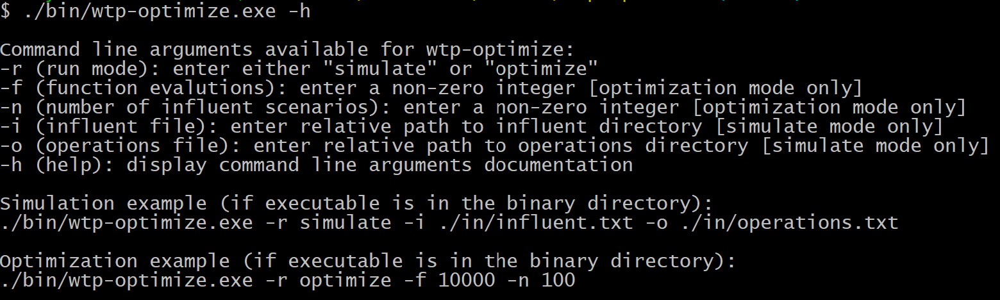

# Multi-objective optimization of water treatment

Improving the resilience and affordability of existing water treatment plants is critical for the safety and financial viability of drinking water systems. This is a repository for a simulation-optimization framework written in C/C++ that generates innovative treatment strategies for water managers. By integrating optimization results with interactive visualizations, this framework represents a shift toward exploration and insight discovery in the drinking water sector.


## Reference

W.J. Raseman, Kasprzyk, J.R., Summers, R.S., Hohner, A.K., Rosario-Ortiz, F.L. (in-review). *Multi-objective optimization of water treatment operations for disinfection byproduct control.*

## Web application

The results of the water treatment optimization described in this work can be explored using the following
[interactive, web-based application](https://wraseman.github.io/parasol/demo/water-treatment.html).

# Contents
- ```.vscode/```: Visual Studio Code directory. Contains configuration files for compiling and debugging code in [Visual Studio Code](https://code.visualstudio.com/).
- ```bin/```: binary files directory. Contains a makefile for compiling the C/C++ code. The executable (or binary) file that results from compilation called ```wtp-optimize.exe```.
- ```figures/```: figures directory.
- ```in/```: inputs directory. Contains the Monte Carlo simulation directory (```in/monte_carlo/```), the simulation configuration directory (```in/single_sim/```), and water treatment process train directory (```in/wtp_train/```). The files contained within these subdirectories define the water quality scenarios used in the framework, the configuration of individual treatment simulations, and the operational and infrastructural characteristics of the simulated treatment processes.
- ```out/```: outputs directory. Contains the results of simulation and optimization runs.
- ```R/```: R programming source code directory. Contains the code for the stochastic water quality generation methods described in [the paper](## Reference). The water quality scenarios generated by this code are located in ```in/monte_carlo```.
- ```src/```: C/C++ source code directory. Contains simulation-optimization code which allows the user to run treatment simulations and multi-objective optimizations. The source code is composed of three parts: 1) ```src/auto_dose/``` the automatic chemical dosing logic, 2) ```src/wtp/``` a modified version of the US EPA Water Treatment Plant Model v2.2, and 3) ```src/wtp_optimize/``` code to couple the WTP Model with the [Borg multi-objective evolutionary algorithm (MOEA)](http://borgmoea.org/).

## Borg MOEA download instructions
The code which contains the [Borg MOEA](http://borgmoea.org/) has been omitted from this repository because the code is not open source. However, the code is free for academic and non-commercial purposes. To request the code, fill out the following [contact form](http://borgmoea.org/#contact). Our code was written to be compatible with Borg v1.8.

To add Borg to the source code, the user must create a new directory: ```src/borg/```. Within this new directory, add the following files from the Borg source code:
- ```borg.cpp```
- ```borg.h```
- ```mt19937ar.cpp```
- ```mt19937ar.h```

## Compile
Once the Borg MOEA has been added to the source code, the code can be compiled. To do so, navigate to the ```bin/``` directory using a command line interface and type:
 ```
 make
 ```
The ```make``` command calls the makefile (```bin/makefile```) to compile the code into an executable called ```bin/wtp-optimize.exe```.

## Run
To get instructions about how to run the simulation-optimization code, call the executable with the ```-h``` flag. For example, the current working directory is the root directory, you would type the following:
```
./bin/wtp-optimize.exe -h
```

The result will be command line instructions for running simulations and optimizations:


## License

This project is licensed under the MIT License - see the [LICENSE.md](LICENSE.md) file for details.

# Collaborators

This project was carried out by the [Kasprzyk Research Group](https://www.colorado.edu/lab/krg/) at the University of Colorado (CU) Boulder in collaboration with others in civil and environmental engineering at CU and Washington State University.   
